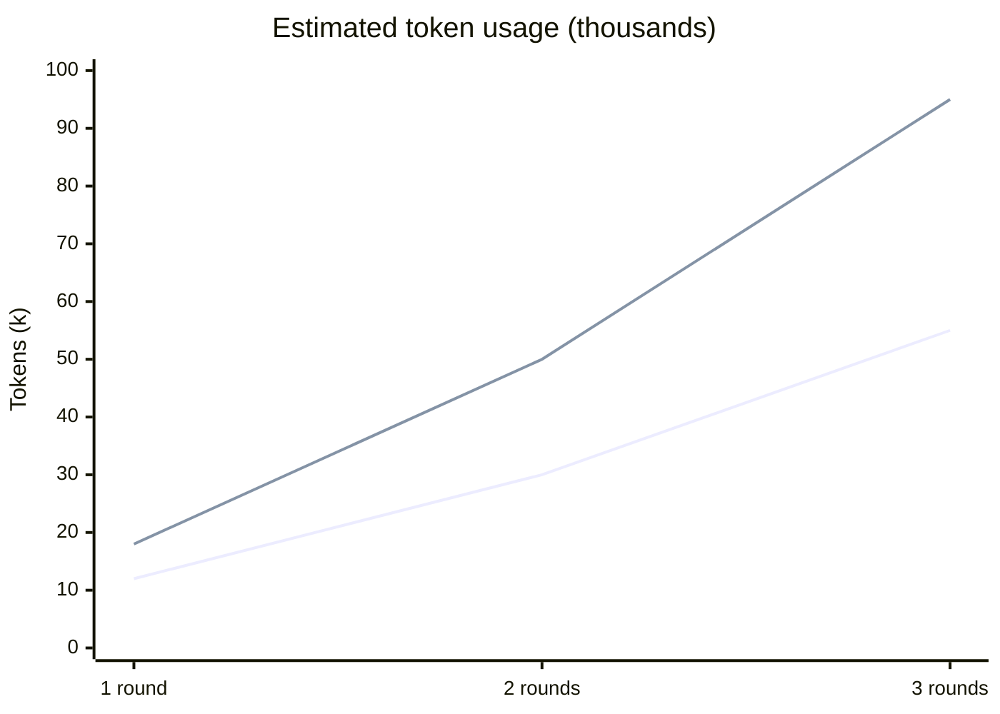

# Forge

**Forge** convenes a panel of AI expert personas to debate, refine, or brainstorm any idea. Each expert argues from their own lens. A Moderator synthesizes a verdict. Three modes, four domain presets.

Use it when you want a second opinion that actually pushes back.

---

## Modes

| Mode | Use when |
|---|---|
| `debate` | You have a proposal and want it stress-tested |
| `hone` | You have a rough idea and want it sharpened |
| `brainstorm` | You have a problem and need options generated |

---

## Use With

**Claude Code**
```
/plugin marketplace add manan-buddhadev/forge
/plugin install forge@forge
```
Then: `/forge:debate "your proposal"`

**Kiro / any AI IDE**
Type in chat:
```
forge debate: your proposal
forge hone: your rough idea
forge brainstorm: your problem
```
The `.kiro/steering/forge.md` file teaches your AI assistant to run the full session.

**CLI** — coming soon (`npx forge debate "..."`)

---

## Examples

```
forge debate: We should use JWTs in localStorage for auth
forge hone: Series A at $8M ARR, 3x growth, targeting $20M raise
forge brainstorm: How do we reduce churn for our B2B SaaS?
forge debate: Should I join a startup or big tech?
forge brainstorm: How do we build a hedge fund algorithm? --roles=finance
```

---

## Persona Presets

| Preset | Personas | Best for |
|---|---|---|
| `default` | First Principles, Risk Analyst, Pragmatist, Contrarian, Synthesizer, Devil's Advocate | Any domain |
| `finance` | Quant Analyst, Risk Manager, Portfolio Manager, Economist | Investing, fund strategy, financial decisions |
| `product` | User Researcher, PM, Growth Strategist, Competitive Intel | Product strategy, monetization, go-to-market |
| `engineering` | Security, Performance, Maintainability, Simplicity, Scalability, DX, Compliance | Technical architecture and code review |

---

## Options

```
--roles=<preset>      default | finance | product | engineering
--rounds=<n>          1-5 (default: 2)
--mode=<mode>         parallel | sequential (default: parallel)
--verbosity=<v>       brief | standard | detailed (default: standard)
--quiet               Show only final verdict
--output=<path>       Export session to markdown
```

---

## How It Works

Forge spawns one expert persona per round. In `parallel` mode all personas respond independently — faster, no cross-influence. In `sequential` mode each persona reads prior responses before replying — slower, but positions evolve and converge.

After all rounds a Moderator synthesizes the transcript: consensus, divergence, recommendation, and confidence rating.

---

## Example Output

```
╔══════════════════════════════════════════════════════════╗
║  FORGE — DEBATE                                          ║
╚══════════════════════════════════════════════════════════╝

Proposal: We should use JWTs in localStorage for auth
Personas: Security Auditor, Performance, Simplicity, Compliance
Rounds:   2 | Mode: parallel

─── Round 1 | Security Auditor ─────────────────────────────

XSS is the critical failure mode here. Any script injected into
your page can read localStorage — JWT included. The blast radius
is total: attacker gets a valid session token with no expiry
enforcement on the client side...

─── Round 1 | Simplicity Champion ──────────────────────────

For a small team with no regulated data, this is the right call.
HttpOnly cookies require backend coordination, CSRF tokens, and
same-site configuration. localStorage is two lines of code...

══════════════════════════════════════════════════════════════
  FORGE VERDICT
══════════════════════════════════════════════════════════════

Consensus: localStorage JWTs are acceptable for low-risk apps
with no PII or regulated data.

Recommendation: Use HttpOnly cookies if you handle any sensitive
data. Use localStorage only if XSS risk is actively mitigated
(CSP headers, no third-party scripts).

Confidence: HIGH

══════════════════════════════════════════════════════════════
```

---

## Token Usage

| Mode | 1 round | 2 rounds | 3 rounds |
|---|---|---|---|
| `parallel` | ~12k | ~30k | ~55k |
| `sequential` | ~18k | ~50k | ~95k |

Assumes 6 personas (default), standard verbosity. Sequential costs more because each persona reads all prior responses — context grows within a round.



> Lines: parallel (lower) vs sequential (upper)

---

## Related

- [hex/claude-council](https://github.com/hex/claude-council) — original multi-provider council (OpenAI + Gemini + Claude)

**Search:** claude council · claude-council · multi-agent debate · ai brainstorm tool · ai idea refinement · claude personas · ai expert panel · forge ai

---

## License

MIT
