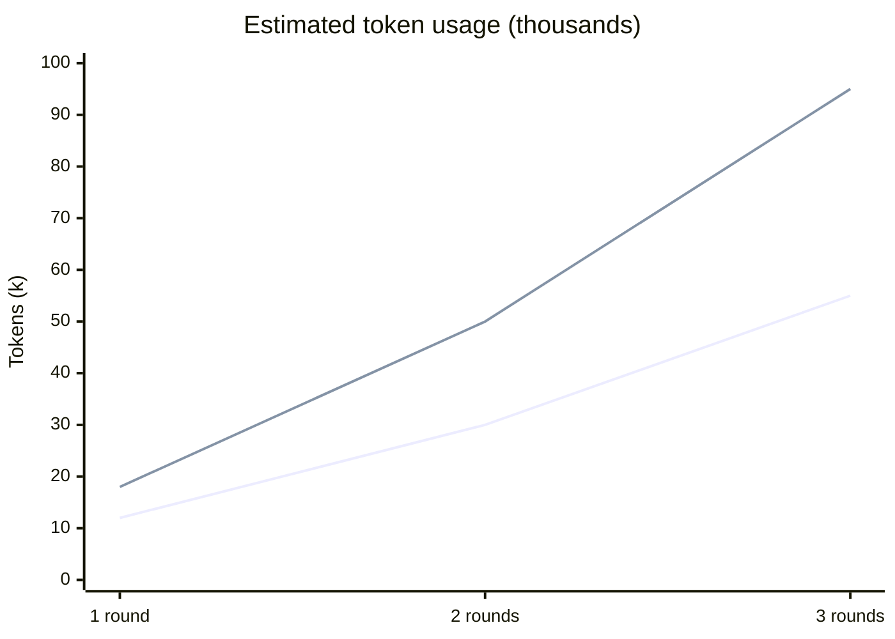

# Forge

A Claude Code skill that convenes a panel of AI personas to debate, refine, or brainstorm any question. Three modes: stress-test a proposal, sharpen a rough idea, or generate options from scratch. Finance, product, and engineering domain overlays. No external APIs — pure Claude.

---

## Skills

| Command | Use when |
|---|---|
| `/forge:debate` | You have a proposal and want it stress-tested |
| `/forge:hone` | You have a rough idea and want it sharpened |
| `/forge:brainstorm` | You have a problem and need options generated |

---

## Install

```
/plugin marketplace add manan-buddhadev/forge
/plugin install forge@forge
```

---

## Dev / local use

```bash
git clone https://github.com/manan-buddhadev/forge.git
claude --plugin-dir ./forge
```

---

## Usage

```
/forge:debate "We should use JWTs in localStorage for auth" --roles=engineering
/forge:hone "Series A at $8M ARR, 3x growth" --roles=finance
/forge:brainstorm "How do we build a hedge fund algorithm?" --roles=finance
/forge:brainstorm "How should we monetize our dev tool?" --roles=product
/forge:debate "Should I join a startup or big tech?"
```

---

## Persona Presets

| Preset | Personas | Best for |
|---|---|---|
| `default` | First Principles, Risk Analyst, Pragmatist, Contrarian, Synthesizer, Devil's Advocate | Any domain |
| `finance` | Quant Analyst, Risk Manager, Portfolio Manager, Economist | Investing, fund strategy, financial decisions |
| `product` | User Researcher, PM, Growth Strategist, Competitive Intel | Product strategy, monetization, go-to-market |
| `engineering` | Security, Performance, Maintainability, Simplicity, Scalability, DX, Compliance | Technical architecture and code review |

---

## Options

```
--roles=<list>        Role names or preset (default: default)
--rounds=<n>          Rounds 1-5 (default: 2)
--mode=<mode>         parallel or sequential (default: parallel)
--verbosity=<v>       brief | standard | detailed (default: standard)
--file=<path>         Attach file as context
--no-auto-context     Skip automatic file detection
--no-cache            Force fresh session
--quiet               Show only final verdict
--output=<path>       Export session to markdown
```

Sessions save to `.claude/forge-history/`. Cache in `.claude/forge-cache/`.

---

## How It Works

Each `/forge` command spawns one Claude sub-agent per persona using the Agent tool. In `parallel` mode all personas run simultaneously. In `sequential` mode each persona reads prior responses before replying. A Moderator agent synthesizes the full transcript into a structured verdict.

---

## Examples

### Stress-test a technical decision
```
/forge:debate "We should store sessions in localStorage with JWTs" --roles=engineering
```
**What happens:** Security Auditor flags XSS exposure, Performance optimizer notes cold-start latency, Simplicity champion argues it's the right call for small teams, Compliance officer flags GDPR implications. Moderator verdict: conditional yes with `HttpOnly` cookie fallback for regulated data.

---

### Sharpen a fundraising narrative
```
/forge:hone "Series A at $8M ARR, 3x growth, targeting $20M raise" --roles=finance
```
**What happens:** Quant Analyst stress-tests the growth multiple against sector comps, Risk Manager asks about net revenue retention and churn, Portfolio Manager reframes the narrative for LP expectations, Economist flags macro headwinds. Moderator delivers a sharpened pitch with three gaps to close before the raise.

---

### Generate options for a hard problem
```
/forge:brainstorm "How do we reduce churn for our B2B SaaS product?" --roles=product
```
**What happens:** User Researcher proposes an onboarding redesign based on activation gaps, PM prioritizes a health-score alerting system, Growth Strategist suggests a paid success tier, Competitive Intel maps where competitors are winning at-risk accounts. Moderator surfaces three distinct bets with a recommended starting point.

---

### Multi-round sequential debate
```
/forge:debate "Should we go multi-tenant or single-tenant SaaS?" --rounds=3 --mode=sequential
```
**What happens:** Round 1 each persona stakes a position. Round 2 each reads the prior speaker and adjusts or sharpens. Round 3 personas respond to convergences and remaining disagreements. Moderator synthesizes into a decision framework with a clear recommendation.

---

## Token Usage

Token costs grow with personas, rounds, and mode. Estimates below assume 6 personas (default preset), standard verbosity, and a ~50-token question.

| Mode | 1 round | 2 rounds | 3 rounds |
|---|---|---|---|
| `parallel` | ~12k | ~30k | ~55k |
| `sequential` | ~18k | ~50k | ~95k |

**Why sequential costs more:** each persona in a round reads all prior speakers' responses. Context grows quadratically within a round. In parallel mode every persona starts from just the question — prior-round transcripts are added flat per round, not per persona.

**Levers to reduce cost:**
- `--verbosity=brief` cuts per-persona response length ~50%
- `--rounds=1` skips refinement entirely
- `--roles=finance` (4 personas) vs `default` (6 personas) saves ~30%
- `--quiet` suppresses streaming output but doesn't change token cost



> Lines: parallel (lower) vs sequential (upper)

---

## License

MIT
